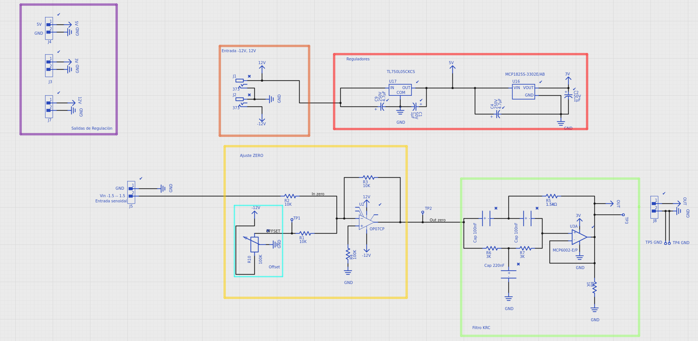
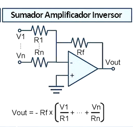
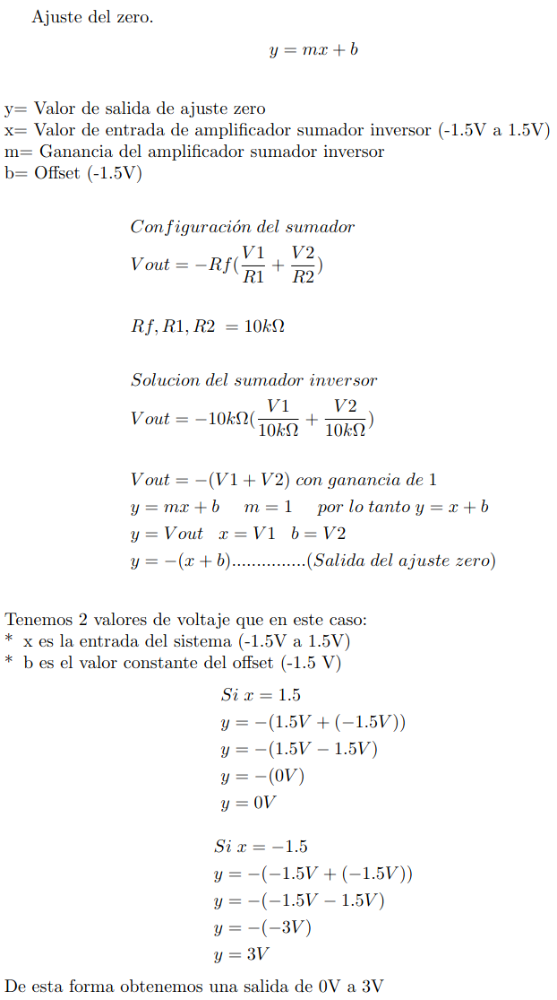
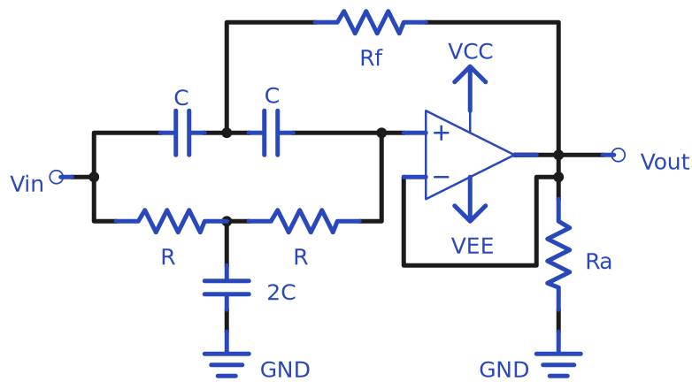
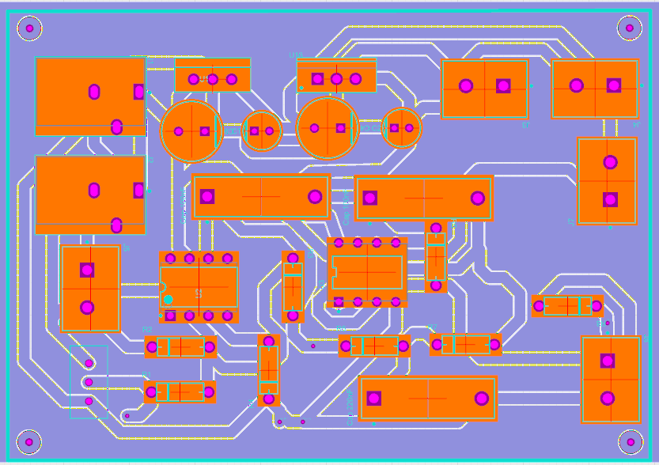

**AJUSTE DE SEÑAL**

***Objetivo***

El objetivo es ajustar una señal senoidal con un valor de entrada de -1.5V a +1.5V. Esta señal se tiene que ajustar a un valor de salida de 0V a 3V.

***Material***.

1 Amplificador operacional OP07

1 Amplificador operacional MCP6002

1 Regulador de voltaje a 5V TL750L05CKCS

1 Regulador de voltaje a 3.3V MCP18255-3302E/AB 

2 Capacitores de poliester de 100 nF MBCO

1 Capacitor de poliester 220 nF MBCO

2 Capacitores electroliticos de 4.7 $\micro$F

2 Capacitores electroliticos de 1 $\micro$F

1 Potenciómetro de ajuste de 100 k$\Omega$	

1 Resistencia de 100 k$\Omega$	

3 Resistencias de 10 k$\Omega$	

1 Resistencia de 1 k$\Omega$	

2 Resistencias de 27 k$\Omega$	

1 Resistencia de 12 k$\Omega$	

***Descripción***

> ​                                                                              Fig 1. Circuito de ajuste de señal
>

El circuito se divide en diferentes secciones:

* **Naranja** 

  Se encuentran dos barrel jack de 2.1 mm con la finalidad de proporcionar una alimentación dual de -12V y +12V.

* ###### **Rojo**

  Existen dos convertidores de voltaje, el TL750L05CKCS que genera una conversión de 12V a 5V y el MCP1825S-330E/AB que regula la señal de 5V a  3.3V, la configuración planteada en el circuito fue obtenida a partir del datasheet de cada uno de los componentes.

* ###### Amarillo

  La sección tiene la función principal del circuito ya que es un ajuste zero, el cual va a generar la inversión de voltaje para que la salida sea de 0V a 3V, esto se logra gracias a la siguiente ecuación:

  ​	$$y=mx+b$$

  $y = Eje\;vertical\;de\;la\;gráfica$

  $x =Eje\;horizontal\;de\;la\;gráfica$

  $m = pendiente\;de \;la \;recta$

  $b = punto\; de\; intersección\; entre\; la\; recta\; y\; el\; eje\; vertical$

  

  La configuración del amplificador en esta sección es de un sumador inversor, como se requiere una ganancia de 1 para que no exista algún tipo de alteración en la señal de entrada, las resistencias conectadas a la entrada inversora del amplificador tienen que ser del mismo valor. 

  

  ​                                                                              Fig 2. Configuración de un sumador

  

  

  En la ecuación el valor en ***y*** es la salida del voltaje, ***x*** se va a ver reflejado como los valores de entrada del circuito, ***m*** como la ganancia del amplificador y ***b*** como el offset del ajuste.

  * ###### Azul

    Offset: es un potenciómetro conectado a la terminal de voltaje negativo por lo cual variara su valor desde -12V a 0V, el circuito tiene un ajuste de offset de -1.5V.

  * ###### Verde

    El filtro notch se realizo de acuerdo al siguiente modelo:

    

    ​                                                                                                       Fig 3. Filtro notch

  Este filtro es para eliminar ruido que se genera en la señal al momento de la salida del ajuste en zero, este filtro como tal no genera perdidas pero si atenúa la señal y se visualiza una señal mas pura en la salida. El filtro que se utilizó fue se basa en una celda KRC de segundo orden. El filtro está sintonizado para eliminar sólo una banda estrecha de frecuencias cercanas a 60 Hz.

  * ###### Morado

    Es la etapa de salida como tal ya que tiene 3 borneras de 2 posiciones, en una posicion se encuentra el voltaje y en otra su respectiva tierra, las salidas son de 3.3V, 5V y 12V.

  ###### *PCB* 

  
  
  ​																		                                Fig 4. Diseño del pcb en upverter

Se realizo la segmentación de las diferentes secciones del pcb para generar una visualización clara y sencilla sobre las áreas que lo componen.

**Nota**: * La bornera de la parte inferior derecha es la salida del circuito, y la salida del filtro notch. * Bornera en la parte media izquierda es la entrada de señal -1.5V a +1.5V

